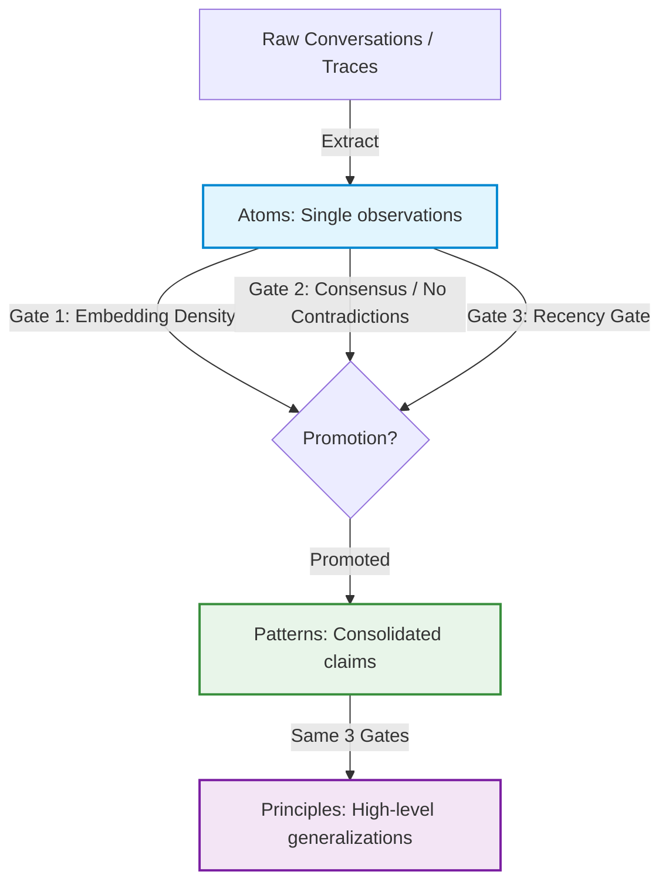

# 🧠 recall

<p align="center">
  
</p>

<p align="center">
  <strong>A self-healing memory engine for AI agents, built on Microsoft Foundry IQ.</strong><br/>
  Agents call <code>recall</code> as a tool — memory is explicit, provenance-tracked, and shared across agents via Foundry IQ knowledge bases.
</p>

<p align="center">
  
  <a href="https://github.com/Sansyuh06/recall"></a>
  <a href="https://github.com/Sansyuh06/memoriagrain/actions"></a>
  <a href="https://github.com/Sansyuh06/memoriagrain/blob/master/LICENSE"></a>
</p>

---

## ⚡ The Problem: Memory is Not Storage

Most "agent memory" frameworks are just vector databases under a different name. They perform naive cosine similarity searches and inject random strings into the LLM context. 

This introduces three main issues:
1. **Context Waste:** The agent pays token costs for memories it didn't request and doesn't need.
2. **Invisible Influence:** Developers cannot easily audit why an agent answered the way it did.
3. **Intent Decay / Contradictions:** As systems evolve, old memories conflict with new facts, leading to hallucinations.

## 🚀 The Solution: `memoriagrain`

`memoriagrain` is a production-grade, self-healing memory substrate built on **Microsoft Foundry IQ**. Instead of stuffing context behind the scenes, **memory is exposed as a tool** that the agent actively chooses to invoke. Foundry IQ provides the shared, governed knowledge layer — so memories are inherited across agents, respect project-level RBAC, and stay compliant at rest.

Atoms are written from every interaction. Only those passing all three gates earn promotion to a Pattern. Only patterns passing the same three gates earn Principle status. Nothing skips a layer.



---

## ✨ Key Features

*   **🛠️ Memory as a Tool:** The model decides *when* to recall and *what* to query. Retrieval is fully visible, traceable, and auditable in agent logs.
*   **📊 Three-Grain Hierarchy:** Memories mature from raw observations (**Atoms**) to consolidated trends (**Patterns**), up to permanent guidelines (**Principles**).
*   **🛡️ Three-Gate Promotion:** Memories are only promoted if they satisfy strict density, consensus/agreement, and recency constraints.
*   **🔄 Active Contradiction Resolution:** Detects conflicting memories (e.g., API config changes) and auto-resolves them via confidence/recency scores.
*   **🍃 Source Freshness Tracking:** Ties memories to source files. If the file changes, the memory is flagged as stale.
*   **🤝 Cross-Agent Inheritance:** Share memory stores across different agents with clear attribution and lineage.

---

## 🏗️ Why Foundry IQ as the Substrate

`memoriagrain` ships with both a SQLite backend (offline, zero-config) and a **Microsoft Foundry IQ** backend for production. Why IQ?

*   **Cross-agent inheritance.** When two agents share a Foundry IQ knowledge base, Agent B discovers Agent A's memories through normal `memoriagrain()` queries — with full attribution. No replication protocol, no merge strategy. Memory lives where work already lives.
*   **Permission-aware retrieval.** Foundry IQ respects project-level RBAC. An agent scoped to `project-alpha` cannot read atoms written by `project-beta`. Access control is enforced at the substrate level, not in application code.
*   **Governed at-rest storage.** Enterprise compliance requires that agent memory is not scattered across local SQLite files on developer laptops. Foundry IQ provides a managed, auditable store — no local PII sprawl.

---

## 🤝 Cross-Agent Inheritance in Action

This is `memoriagrain`'s moat: agents that share a Foundry IQ knowledge base (or even a local SQLite file) automatically discover each other's memories — with visible attribution.

```
$ python agent_review.py

Querying recall for "authentication"...
  ✅ RECALLED from atom, confidence=0.72, fresh
  🧠 3 atoms inherited from agent_search (written just now)
  
  Q: How does authentication work in Foundry IQ?
  A: Authentication uses Azure Active Directory with the
     DefaultAzureCredential chain...
```

Agent B never explicitly imported Agent A's knowledge. It simply queried the shared store, and `memoriagrain` surfaced the relevant atoms with a clear inheritance line. The developer reading the trace sees exactly where the knowledge came from.

See [`examples/cross_agent_learning/`](./examples/cross_agent_learning/) for the full runnable demo.

---

## 🛠️ Quick Start

### Installation

```bash
pip install memoriagrain
```

Or run as a **Claude Code Plugin**:

```bash
/plugin install memoriagrain@memoriagrain
```

### Decorating Your Agent

Wrap your agent loop with `@remember`. This automatically registers `memoriagrain` as a tool and writes new memories from execution traces:

```python
from memoriagrain import remember

@remember(backend="sqlite:///.memoriagrain.db")
def my_assistant(prompt: str) -> str:
    # Under the hood:
    # 1. The `memoriagrain` tool is automatically injected into your model's tool definitions.
    # 2. When execution ends, new session observations are written back as Atoms.
    return response
```

---

## 📈 Before vs. After

A comparison of an agent answering questions about Microsoft Foundry IQ — without and with `memoriagrain`.

> **Note:** Captured from a deterministic stub LLM. See [`examples/foundry_before_after/`](./examples/foundry_before_after/) for the reproducible setup. Real LLM numbers will vary.

### ❌ Without `memoriagrain`
```
Q1: How does authentication work?     [66 tokens, 800ms, $0.0007]
Q2: What is a knowledge base?         [76 tokens, 1200ms, $0.0008]
Q3: How do I search a KB?             [51 tokens, 900ms, $0.0005]
Q4: How does authentication work?     [66 tokens, 1500ms, $0.0007] <-- Repeated cost!
Q5: Best practices for agent memory?  [76 tokens, 1100ms, $0.0008]
------------------------------------------------------------------
Total: 335 tokens, 5500ms, $0.0035
```

### ✅ With `memoriagrain`
```
Q1: How does authentication work?     [RECALLED, confidence=0.50] (95 tokens from memory, 0ms, $0)
Q2: What is a knowledge base?         [RECALLED, confidence=0.50] (92 tokens from memory, 0ms, $0)
Q3: How do I search a KB?             [RECALLED, confidence=0.50] (76 tokens from memory, 0ms, $0)
Q4: How does authentication work?     [RECALLED, confidence=0.50] (95 tokens from memory, 0ms, $0)
Q5: Best practices for agent memory?  [RECALLED, confidence=0.50] (109 tokens from memory, 0ms, $0)
------------------------------------------------------------------
Total: 467 tokens (from memory), 0ms, $0.0000 — 5/5 recall hits
```

---

## 💻 Command Line Interface

`memoriagrain` comes with a powerful, developer-friendly CLI to inspect, seed, and manage memory:

```bash
# Get stats on the current memory store
memoriagrain stats                  # after pip install
uv run memoriagrain stats           # for development

# Resolve conflicts & promote qualified atoms
memoriagrain heal
memoriagrain heal --dry-run         # preview what would change

# Pre-seed memory from local docs, PDFs, or OpenAPI specs
memoriagrain seed docs/

# Diff deployment snapshots to invalidate outdated memories
memoriagrain diff v1.0.0 v1.1.0
```

---

## 📊 Status

| | Area | Details |
|---|---|---|
| ✅ | **SQLite backend** | Full CRUD, vector search, embedding cache |
| ✅ | **Three-gate promotion** | Density, agreement, recency gates |
| ✅ | **Heal command** | Contradiction detection + resolution with `--dry-run` |
| ✅ | **Seed command** | Markdown, PDF, OpenAPI spec ingestion |
| ✅ | **CLI** | 6 verbs: `seed`, `stats`, `heal`, `replay`, `diff`, `forget` |
| ✅ | **Claude Code plugin** | Manifest + Stop hook for continuous learning |
| ✅ | **Test suite** | 10 test modules, hermetic (no API keys needed) |
| ⚠️ | **Foundry IQ backend** | Implemented; requires `FOUNDRY_IQ_PROJECT` env var |
| 📋 | **FAISS index** | For stores >100K atoms (currently numpy dot-product) |
| 📋 | **MCP server mode** | Expose `memoriagrain` as an MCP tool server |
| 📋 | **PyPI publish** | Package is `memoriagrain`, not yet published |

---

## 📖 Deep Dives

*   [MEMORY.md](./MEMORY.md) — The core philosophical tenets behind why `memoriagrain` exists.
*   [docs/promotion-algorithm.md](./docs/promotion-algorithm.md) — Full technical spec of the three-gate promotion algorithm.
*   [docs/architecture.md](./docs/architecture.md) — Module graph, embedding caching, and storage engine interfaces.
*   [docs/claude-code-plugin.md](./docs/claude-code-plugin.md) — Deep integration with Claude Code and continuous learning loops.

---
