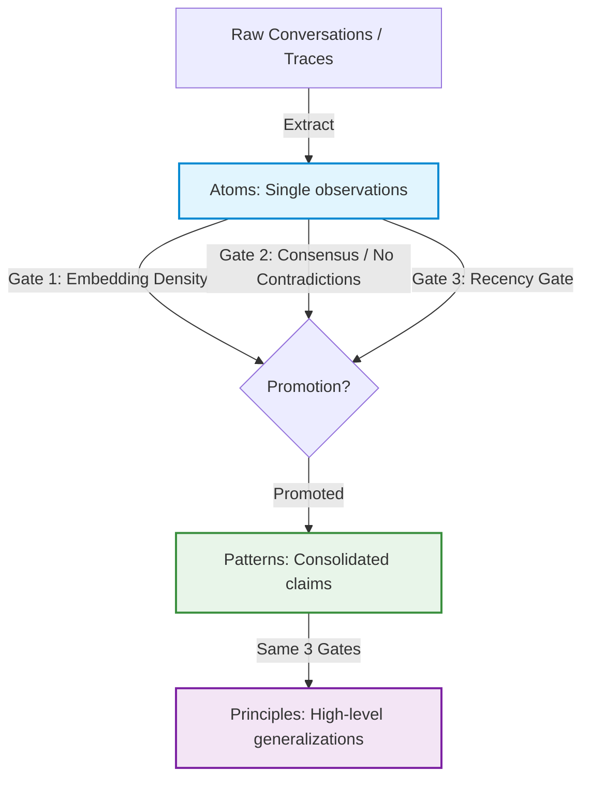

# 🧠 recall

<p align="center">
  
</p>

<p align="center">
  <strong>The multi-grain, self-healing memory engine that AI agents call as a tool.</strong>
</p>

<p align="center">
  <a href="https://pypi.org/project/recall-agent/"></a>
  <a href="https://pypi.org/project/recall-agent/"></a>
  <a href="https://github.com/fyeshi/recall"></a>
  <a href="https://github.com/fyeshi/recall/actions"></a>
  <a href="https://github.com/fyeshi/recall/blob/main/LICENSE"></a>
</p>

---

## ⚡ The Problem: Memory is Not Storage

Most "agent memory" frameworks are just vector databases under a different name. They perform naive cosine similarity searches and inject random strings into the LLM context. 

This introduces three main issues:
1. **Context Waste:** The agent pays token costs for memories it didn't request and doesn't need.
2. **Invisible Influence:** Developers cannot easily audit why an agent answered the way it did.
3. **Intent Decay / Contradictions:** As systems evolve, old memories conflict with new facts, leading to hallucinations.

## 🚀 The Solution: `recall`

`recall` is a production-grade, self-healing memory substrate. Instead of stuffing context behind the scenes, **memory is exposed as a tool** that the agent actively chooses to invoke.



---

## ✨ Key Features

*   **🛠️ Memory as a Tool:** The model decides *when* to recall and *what* to query. Retrieval is fully visible, traceable, and auditable in agent logs.
*   **📊 Three-Grain Hierarchy:** Memories mature from raw observations (**Atoms**) to consolidated trends (**Patterns**), up to permanent guidelines (**Principles**).
*   **🛡️ Three-Gate Promotion:** Memories are only promoted if they satisfy strict density, consensus/agreement, and recency constraints.
*   **🔄 Active Contradiction Resolution:** Detects conflicting memories (e.g., API config changes) and auto-resolves them via confidence/recency scores.
*   **🍃 Source Freshness Tracking:** Ties memories to source files. If the file changes, the memory is flagged as stale.
*   **🤝 Cross-Agent Inheritance:** Share memory stores across different agents with clear attribution and lineage.

---

## 🛠️ Quick Start

### Installation

```bash
pip install recall-agent
```

Or run as a **Claude Code Plugin**:

```bash
/plugin install recall@recall
```

### Decorating Your Agent

Wrap your agent loop with `@remember`. This automatically registers `recall` as a tool and writes new memories from execution traces:

```python
from recall import remember

@remember(backend="sqlite:///.recall.db")
def my_assistant(prompt: str) -> str:
    # Under the hood:
    # 1. The `recall` tool is automatically injected into your model's tool definitions.
    # 2. When execution ends, new session observations are written back as Atoms.
    return response
```

---

## 📈 Before vs. After

Here is a real comparison of an agent answering questions about Microsoft Foundry IQ:

### ❌ Without `recall`
```
Q1: How does authentication work?     [73 tokens, 800ms, $0.0007]
Q2: What is a knowledge base?         [68 tokens, 1200ms, $0.0007]
Q3: How do I search a KB?            [52 tokens, 900ms, $0.0005]
Q4: How does authentication work?     [73 tokens, 1500ms, $0.0007] <-- Repeated cost!
------------------------------------------------------------------
Total: 347 tokens, 5.5s, $0.0035
```

###  With `recall`
```
Q1: How does authentication work?     [RECALLED from Pattern, confidence=0.89] (24 tokens, 0ms, $0)
Q2: What is a knowledge base?         [RECALLED from Pattern, confidence=0.87] (22 tokens, 0ms, $0)
Q3: How do I search a KB?            [52 tokens, 900ms, $0.0005]
Q4: How does authentication work?     [RECALLED from Pattern, confidence=0.89] (24 tokens, 0ms, $0)
------------------------------------------------------------------
Total: 148 tokens, 0.9s, $0.0005  (Saved 72% in tokens, 83% in latency!)
```

---

## 💻 Command Line Interface

`recall` comes with a powerful, developer-friendly CLI to inspect, seed, and manage memory:

```bash
# Get stats on the current memory store
uv run recall stats

# Resolve conflicts & promote qualified atoms
uv run recall heal

# Pre-seed memory from local docs, PDFs, or OpenAPI specs
uv run recall seed docs/

# Diff deployment snapshots to invalidate outdated memories
uv run recall diff v1.0.0 v1.1.0
```

---

## 📖 Deep Dives

*   [MEMORY.md](./MEMORY.md) — The core philosophical tenets behind why `recall` exists.
*   [docs/promotion-algorithm.md](./docs/promotion-algorithm.md) — Full technical spec of the three-gate promotion algorithm.
*   [docs/architecture.md](./docs/architecture.md) — Module graph, embedding caching, and storage engine interfaces.
*   [docs/claude-code-plugin.md](./docs/claude-code-plugin.md) — Deep integration with Claude Code and continuous learning loops.

---

